

受講生募集システム

# 受講生募集システム・Student Management System

サービス概要

## サービス概要

このプロジェクトは、オンラインITスクールのWebアプリケーション開発コースを受講中に作成しました。
シンプルな使い方を中心にしたCRUD処理(Create, Read, Update, Delete)、受講生情報を管理するアプリケーションです。

技術スタック

## 技術スタック

### 開発言語・フレームワーク
#### バックエンド

#### フロントエンド

#### データベース・インフラストラクチャー

#### ドキュメンテーション・ツール

開発プロセス

## 開発プロセス

Java・Spring BootをプログラミンスクールのWebアプリケーション開発講座に沿って作成したプロジェクトになります。

#### →開発の流れ

#### バックエンド

1. 講座を視聴し、技術やツールの知識を得る。
2. 課題に基づいた新機能を実装する。
3. **プルリクエスト形式で提出し、講師に確認してもらう。**
4. レビューを基にした修正・追加を行う。
5. 問題なければ、次の講座へ進む。

#### フロントエンド

1. Google Geminiの「ガイド付き学習モード」を使用し、フロントエンド設計や機能を考慮。
2. Next.js・TailwindCSS・フォーラム、様々なドキュメントや既存アプリを参考にして実装。
3. Google Chrome検証モードを使いながら動作確認。
4. 一つの機能を実装した後、次の機能をTrelloに追加し、翌日より実装を続く

機能一覧

## 機能一覧

| 機能        | 詳細                         | 
|:---------|----------------------------|
| 新規登録 | 受講生情報、コース情報、申込状況を含む受講生詳細を新規登録 | 
| 条件検索| 氏名、メールアドレス、性別、コース名、申込状況の@RequestParamによる条件検索 | 
|単一取得 | IDに基づき、一意の受講生詳細を取得| 
|情報更新| 既存の受講生詳細データ（年齢、氏名など）を上書き更新 | 
| 論理削除 | wasDeletedフラグをtrueに更新し、データベースから物理削除せずに論理的に削除。 | 

※ 定義は以下のとおりです。

- 受講生詳細: 受講生、コース詳細をもつオブジェクト 
  - 受講生: 氏名、メールアドレス、性別、年齢などをもつオブジェクト 
  - コース詳細: コース、申込状況 
    - コース: コース名、開始日、終了日をもつオブジェクト 
    - 申込状況: 仮申込、本申込、受講中、受講終了をもつオブジェクト 

使用イメージ

## 使用イメージ

### ログイン画面・ダッシュボード

https://github.com/user-attachments/assets/8b5cf63f-6df2-4cb1-82a4-3442fa7dda5b

### 受講生一覧・検索バー

https://github.com/user-attachments/assets/47b9a2f8-bbaf-472f-82e8-5f4910e60d6f

### 新規登録

https://github.com/user-attachments/assets/1c0677de-f47a-4739-88af-f6288201f94b

### 受講生情報・編集

https://github.com/user-attachments/assets/1e1cead2-e0de-43a4-aa47-b62b697f5c7b

### 受講生・論理削除

https://github.com/user-attachments/assets/94722523-6ab0-4076-9184-8c2b01b94c0e

### 削除済みから復元

https://github.com/user-attachments/assets/39baba89-766c-4e41-899f-27bb2abf8dc6

設計書

## 設計書

ER図・API仕様書

### ER図

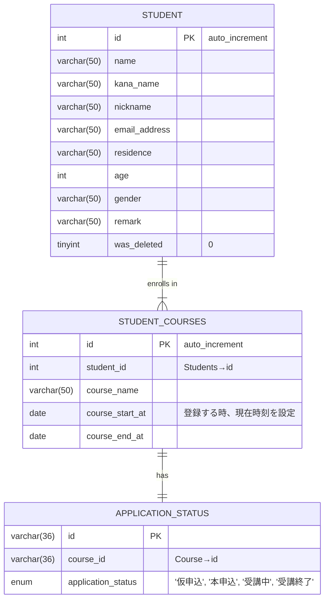
```mermaid 
erDiagram
    STUDENT ||--|{ STUDENT_COURSES: "enrolls in"
    STUDENT_COURSES ||--|| APPLICATION_STATUS: "has"
    STUDENT {
        int id PK "auto_increment"
        varchar(50) name
        varchar(50) kana_name
        varchar(50) nickname
        varchar(50) email_address
        varchar(50) residence
        int age
        varchar(50) gender
        varchar(50) remark
        tinyint was_deleted "0"
    }    
    STUDENT_COURSES {
        int id PK "auto_increment"
        int student_id "Students→id"
        varchar(50) course_name
        date course_start_at "登録する時、現在時刻を設定"
        date course_end_at
    }
    APPLICATION_STATUS {
        varchar(36) id PK
        varchar(36) course_id "Course→id"
        enum application_status "'仮申込', '本申込', '受講中', '受講終了'"
    }
```

### API仕様書
SwaggerによるAPI仕様書

1. Index
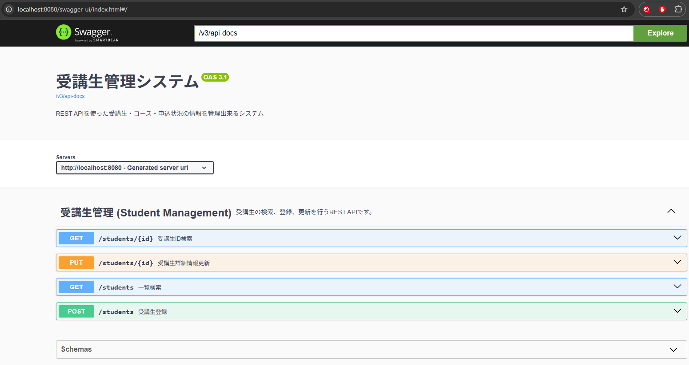
2. GET /students/{id} 受講生ID検索
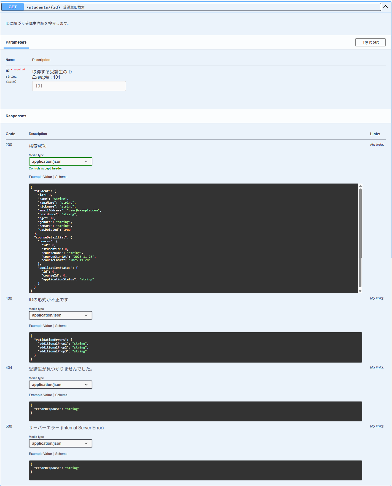
3. PUT /students/{id} 受講生詳細情報更新
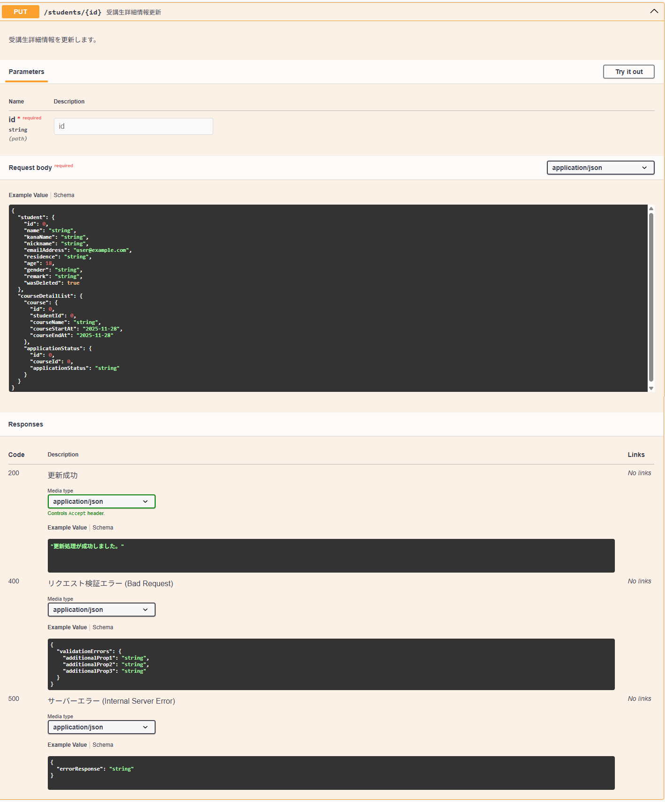
4. GET /students 一覧検索
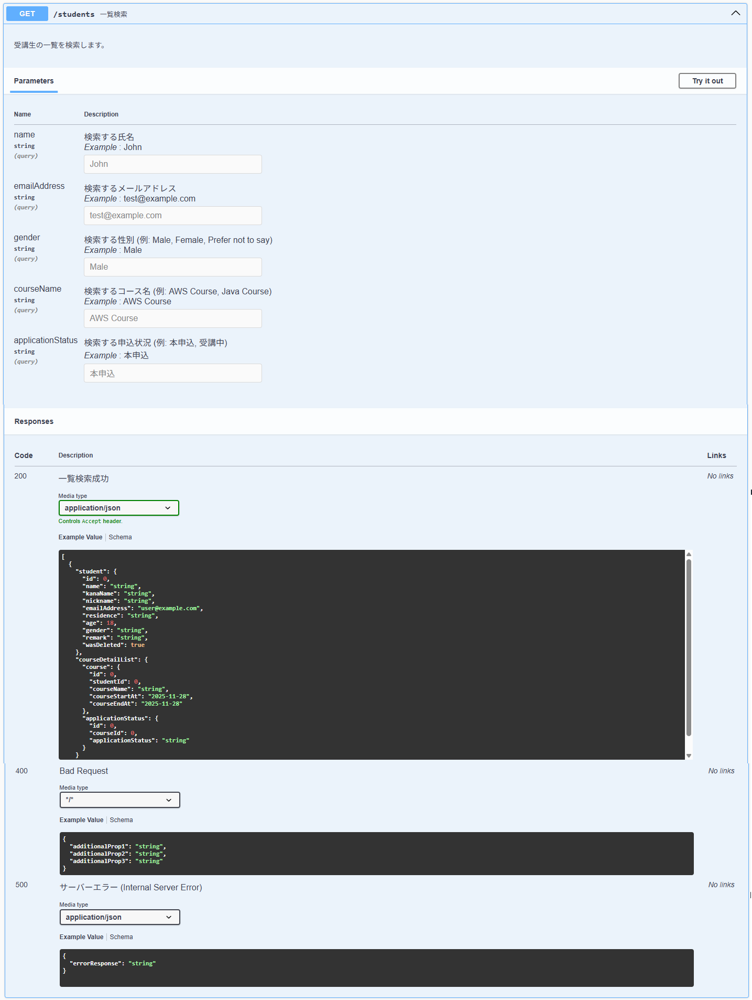
5. POST /students 受講生登録
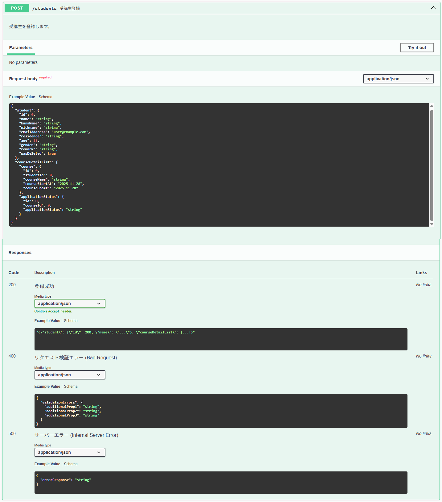
6. Schema
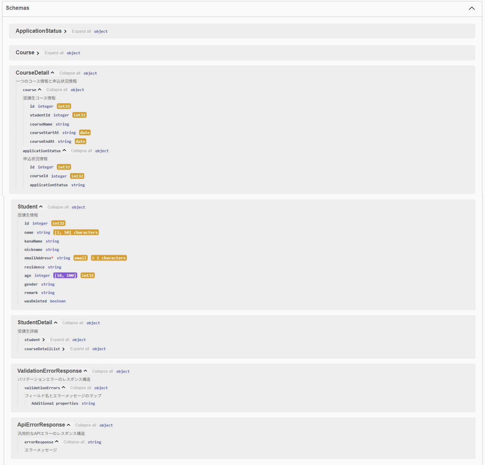

シーケンス図

### シーケンス図 

#### 受講生詳細の新規登録フロー
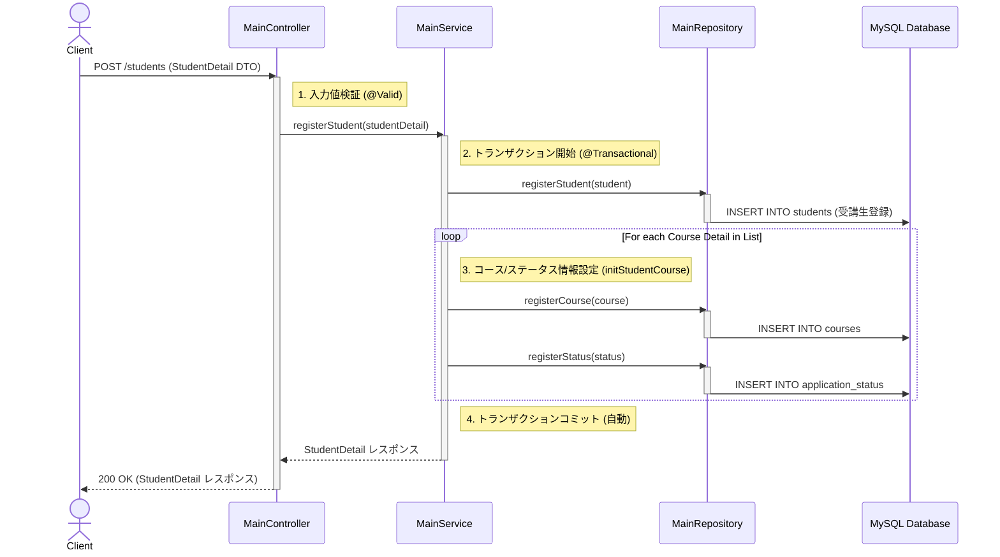
```mermaid
sequenceDiagram
    actor C as Client
    participant Ctrl as MainController
    participant S as MainService
    participant R as MainRepository
    participant DB as MySQL Database

    C->>Ctrl: POST /students (StudentDetail DTO)
    activate Ctrl
    Note right of Ctrl: 1. 入力値検証 (@Valid)

    Ctrl->>S: registerStudent(studentDetail)
    activate S
    Note right of S: 2. トランザクション開始 (@Transactional)

    S->>R: registerStudent(student)
    activate R
    R->>DB: INSERT INTO students (受講生登録)
    deactivate R

    loop For each Course Detail in List
        Note right of S: 3. コース/ステータス情報設定 (initStudentCourse)
        S->>R: registerCourse(course)
        activate R
        R->>DB: INSERT INTO courses
        deactivate R

        S->>R: registerStatus(status)
        activate R
        R->>DB: INSERT INTO application_status
        deactivate R
    end

    Note right of S: 4. トランザクションコミット (自動)
    S-->>Ctrl: StudentDetail レスポンス
    deactivate S

    Ctrl-->>C: 200 OK (StudentDetail レスポンス)
    deactivate Ctrl
```
#### 受講生詳細の更新フロー・論理削除フロー
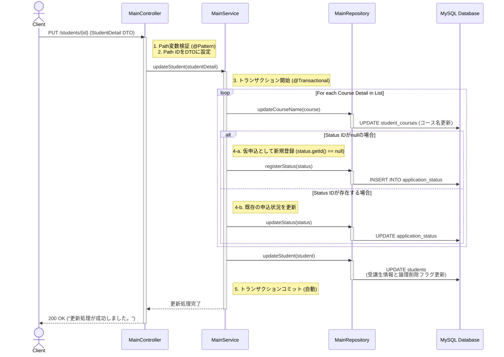
```mermaid

sequenceDiagram
actor C as Client
participant Ctrl as MainController
participant S as MainService
participant R as MainRepository
participant DB as MySQL Database

    C->>Ctrl: PUT /students/{id} (StudentDetail DTO)
    activate Ctrl
    
    Note right of Ctrl: 1. Path変数検証 (@Pattern)<br/>2. Path IDをDTOに設定
    
    Ctrl->>S: updateStudent(studentDetail)
    activate S
    Note right of S: 3. トランザクション開始 (@Transactional)

    loop For each Course Detail in List
        S->>R: updateCourseName(course)
        activate R
        R->>DB: UPDATE student_courses (コース名更新)
        deactivate R
        
        alt Status IDがnullの場合
            Note right of S: 4-a. 仮申込として新規登録 (status.getId() == null)
            S->>R: registerStatus(status)
            activate R
            R->>DB: INSERT INTO application_status
            deactivate R
        else Status IDが存在する場合
            Note right of S: 4-b. 既存の申込状況を更新
            S->>R: updateStatus(status)
            activate R
            R->>DB: UPDATE application_status
            deactivate R
        end
    end
    
    S->>R: updateStudent(student)
    activate R
    R->>DB: UPDATE students<br/>(受講生情報と論理削除フラグ更新)
    deactivate R

    Note right of S: 5. トランザクションコミット (自動)
    S-->>Ctrl: 更新処理完了
    deactivate S
    
    Ctrl-->>C: 200 OK ("更新処理が成功しました。")
    deactivate Ctrl
```
#### 受講生詳細の条件検索フロー
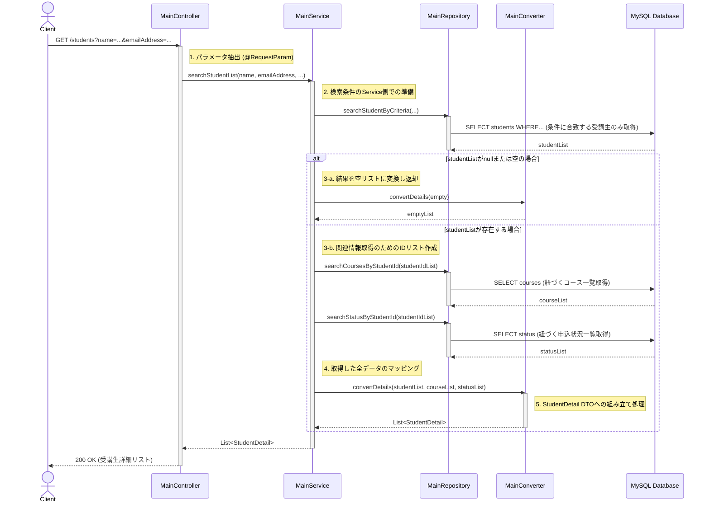
```mermaid
sequenceDiagram
    actor  C as Client
    participant Ctrl as MainController
    participant S as MainService
    participant R as MainRepository
    participant Conv as MainConverter
    participant DB as MySQL Database

    C->>Ctrl: GET /students?name=...&emailAddress=...
    activate Ctrl
    
    Note right of Ctrl: 1. パラメータ抽出 (@RequestParam)
    
    Ctrl->>S: searchStudentList(name, emailAddress, ...)
    activate S
    
    Note right of S: 2. 検索条件のService側での準備
    
    S->>R: searchStudentByCriteria(...)
    activate R
    R->>DB: SELECT students WHERE... (条件に合致する受講生のみ取得)
    DB-->>R: studentList
    deactivate R
    
    alt studentListがnullまたは空の場合
        Note right of S: 3-a. 結果を空リストに変換し返却
        S->>Conv: convertDetails(empty)
        Conv-->>S: emptyList
    else studentListが存在する場合
        Note right of S: 3-b. 関連情報取得のためのIDリスト作成
        S->>R: searchCoursesByStudentId(studentIdList)
        activate R
        R->>DB: SELECT courses (紐づくコース一覧取得)
        DB-->>R: courseList
        deactivate R
        
        S->>R: searchStatusByStudentId(studentIdList)
        activate R
        R->>DB: SELECT status (紐づく申込状況一覧取得)
        DB-->>R: statusList
        deactivate R
        
        Note right of S: 4. 取得した全データのマッピング
        S->>Conv: convertDetails(studentList, courseList, statusList)
        activate Conv
        Note right of Conv: 5. StudentDetail DTOへの組み立て処理
        Conv-->>S: List<StudentDetail>
        deactivate Conv
    end
    
    S-->>Ctrl: List<StudentDetail>
    deactivate S
    
    Ctrl-->>C: 200 OK (受講生詳細リスト)
    deactivate Ctrl
```
#### 一意の受講生詳細を検索
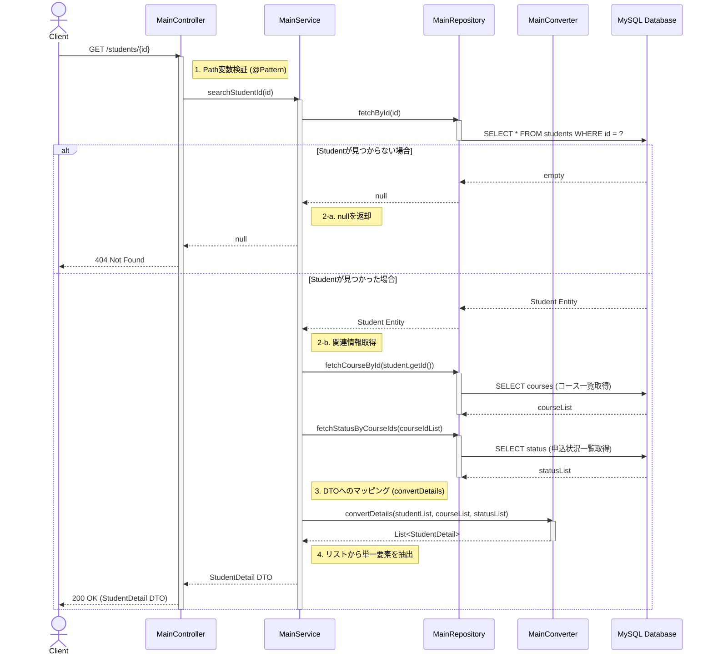
```mermaid
sequenceDiagram
    actor C as Client
participant Ctrl as MainController
participant S as MainService
participant R as MainRepository
participant Conv as MainConverter
participant DB as MySQL Database

C->>Ctrl: GET /students/{id}
activate Ctrl

Note right of Ctrl: 1. Path変数検証 (@Pattern)

Ctrl->>S: searchStudentId(id)
activate S

S->>R: fetchById(id)
activate R
R->>DB: SELECT * FROM students WHERE id = ?
deactivate R

alt Studentが見つからない場合
DB-->>R: empty
R-->>S: null
Note right of S: 2-a. nullを返却
S-->>Ctrl: null
Ctrl-->>C: 404 Not Found
else Studentが見つかった場合
DB-->>R: Student Entity
R-->>S: Student Entity

Note right of S: 2-b. 関連情報取得

S->>R: fetchCourseById(student.getId())
activate R
R->>DB: SELECT courses (コース一覧取得)
DB-->>R: courseList
deactivate R

S->>R: fetchStatusByCourseIds(courseIdList)
activate R
R->>DB: SELECT status (申込状況一覧取得)
DB-->>R: statusList
deactivate R

Note right of S: 3. DTOへのマッピング (convertDetails)
S->>Conv: convertDetails(studentList, courseList, statusList)
activate Conv
Conv-->>S: List<StudentDetail>
deactivate Conv

Note right of S: 4. リストから単一要素を抽出
S-->>Ctrl: StudentDetail DTO

Ctrl-->>C: 200 OK (StudentDetail DTO)
end

deactivate S
deactivate Ctrl
```

APIのURI設計・Postman・リスポンス確認

### APIのURI設計

| HTTPメソッド | URIパス (URI Path)                     | 処理内容                  |
|:---------|------------------------------|-----------------------|
| POST     |/students  | 受講生詳細の新規登録            |
| GET     |/students  | 受講生詳細の条件検索            |
| GET   | /students/{id} | IDに基づき、一意の受講生詳細を検索    |
| PUT     | /students/{id}| IDに基づき、一意の受講生詳細を更新    |
| PUT    |/students/{id} | IDに基づき、受講生情報を取得し、論理削除 |

### Postman・リスポンス確認

#### GET　受講生の一覧検索
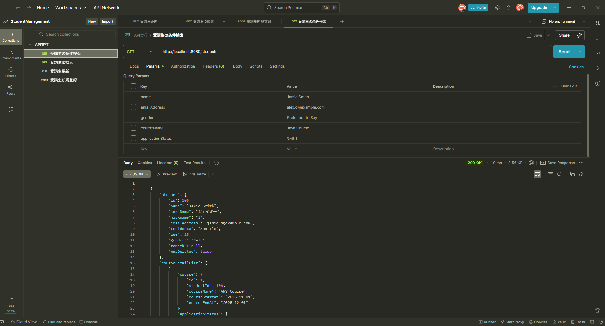

#### GET
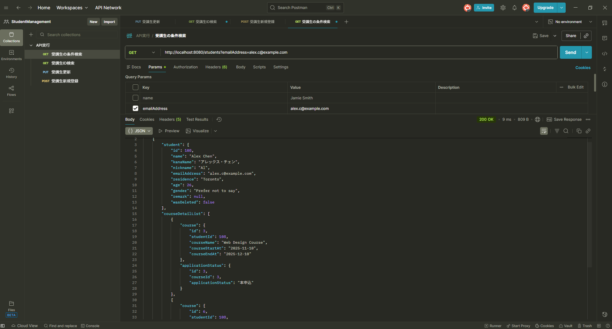

#### GET
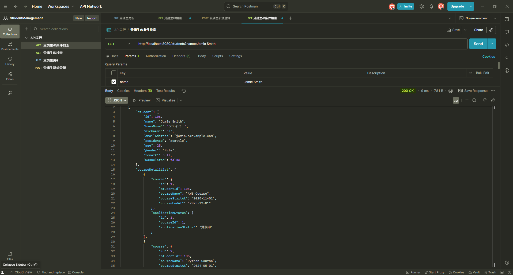

#### GET

#### GET id - PUT before
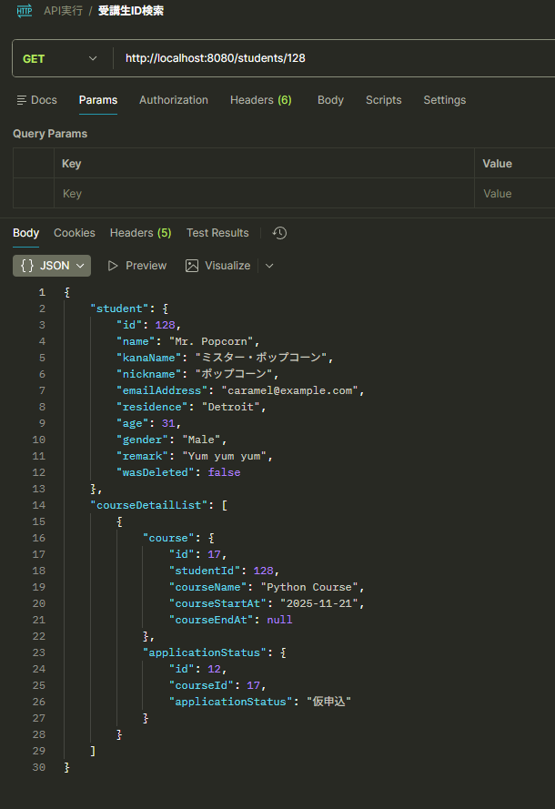

#### PUT 200 ok

#### GET id - PUT after
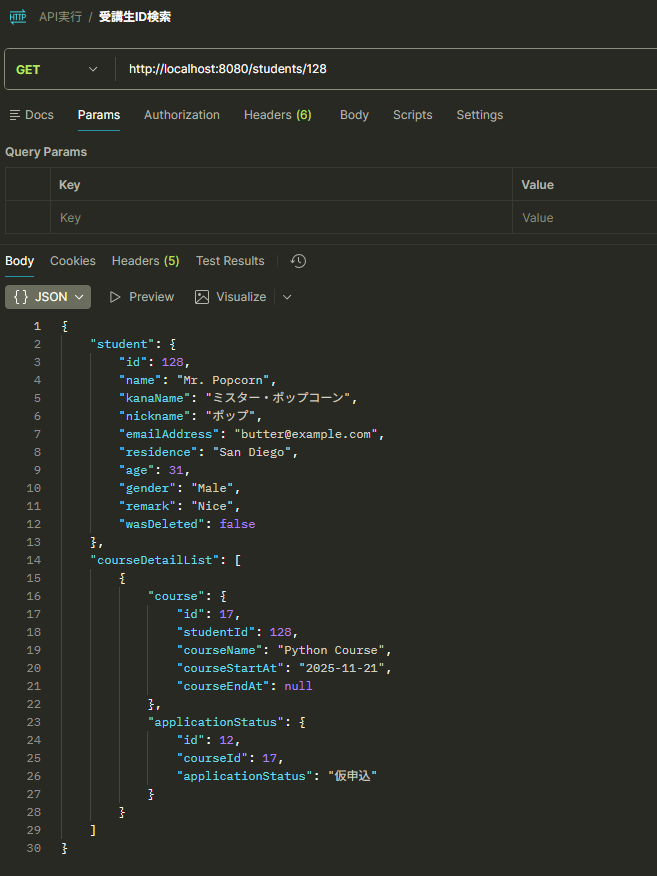

#### POST body
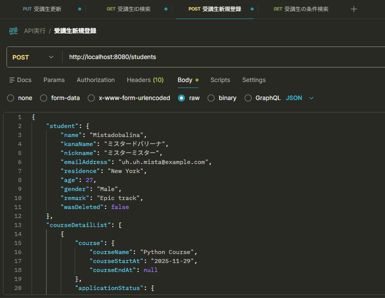

#### POST result
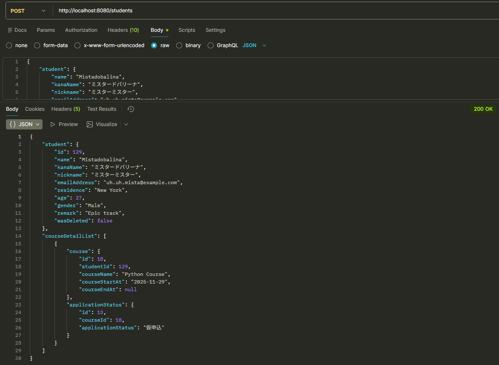

テスト

## テスト

下記のテストは・Junit5・Mockito・を使用したテストです。

### MainControllerテスト
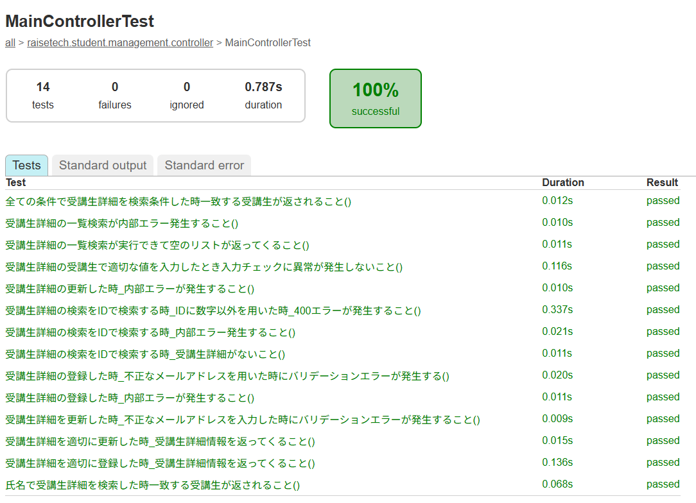

### MainConverterテスト
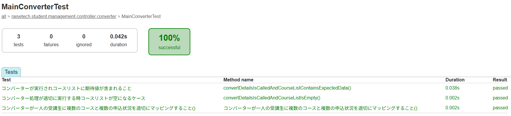

### MainRepositoryテスト
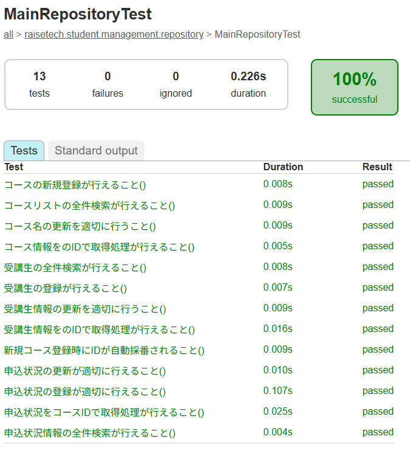

### MainServiceテスト

力を入れたところ

## 力を入れたところ

・このアプリケーションはWebアプリ開発の知識をゼロから挑戦し、環境構築からフルスタックアプリまで、
色んな技術やツールを怖がらず試し、単純に言うと楽しく実装してきました。

Java・SpringBootのコースを完走した後、フロントエンドを勉強して、最新技術を使用したアプリケーションになります。

Javaコースの最終課題に「申込状況」の追加と言うことで、全体的にリファクタリングし、メソッド名やテストケースを修正しました。

- StudentDetail
  - Student
  - Course
から
- StudentDetail
  - Student
  - CourseDetail
    - Course
    - ApplicationStatus
への変更。

【以前のデータ設計】 受講生 1 : 多 コース　 
【リファクタリング後の設計】 受講生 1 : 多 コース、コース 1 : 1 申込状況  

・URI Path を REST APIエンドポイントの命名に関するベストプラクティスを考慮しました。

→/registerStudent・/updateStudent・などを　/students・/students/{id}　に変更。 
その後、フロントエンドを実装する時に＠RequestMapping("/api/v1...")を追加。 

・クライアント側でユーザビリティを大切にして、自動採番処理を実装してきました。 

- 受講を新規登録 → 氏名、メールアドレス、年齢、コース名などを入力(入力値検証あり)
- 登録のリクエスト　→　コース開始日、申込状況を自動採番
- 論理削除をしたい場合は、更新処理で簡単にできるようにしています(削除フラグを変更)

・フロントエンド機能について

話題のNext.jsに興味があり、JavaScript,TypeScript,Reactの基礎知識を学習し、
Next.js公式サイトにある「App Router」コースを独学しました。

設計やReact Treeを大事にして、ユーザーが簡単に使えるようにフロントエンドを実装してみました。

【AWS環境でのデプロイと運用】  
・ EC2、RDS、VPC、セキュリティグループ、そしてNACLを使用して、アプリケーションをAWS上にデプロイしました。 
≪現在、デプロイはしていません≫  

【最大の課題：独学から実際にコーディングへ】 
Javaコース中でも感じたことであり、プログラミング文法を覚えても、実装までの流れは難しいと思いました。 
しかし、経験者でも完璧に実装をできることはなく、調べる・エラーに慣れる・質問をする・手を動かすことが一番大事だと思います。 

フロントエンドは特に、メンターや講師に一切連絡取れず、自分の力でドキュメント・フォーラム・AIツールなどを使用しながら、モダーン的な流れでした。 

その結果は、チームやサポーターがいることを大切にし、コミュニケーションをうまく取るのと、遠慮なく手を上げて質問することが最も大事だと思います。 

今後の展望

## 今後の展望

・Light/Darkモード　 

・受講生カード機能に、ユーザー側よりプロフィール写真を追加できるように。  

・レスポンシブ対応  
  →スマホやタブレットでアプリを使用する時、ユーザビリティを中心にして実装。 
  
・ログイン機能  
  →ログイン済みの時だけ編集や新規登録ができる。ゲストとして使用中に個人情報を表示せず、編集ができないことなどを実装。  
  
・フルスタックアプリケーションとしてデプロイ。 

・フロントエンドテストを追加。 

・スタイリングの修正や変更。 

